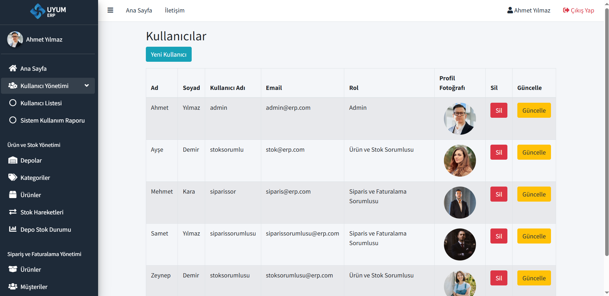
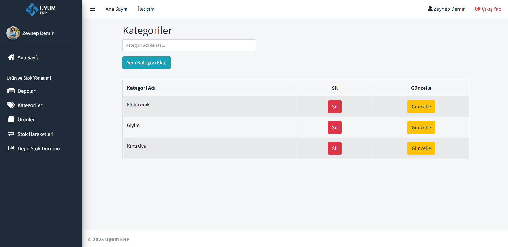

## Türkçe Açıklama

# Mini ERP - Uyum ERP

Bu proje, **Küçük ve Orta Ölçekli İşletmeler** için tasarlanmış, kullanıcı dostu ve modüler bir **ERP (Enterprise Resource Planning)** sistemidir. Projede **Admin**, **Ürün ve Stok Sorumlusu** ve **Sipariş ve Faturalama Sorumlusu** olmak üzere 3 farklı rol bulunmaktadır. Sistem, **AdminLTE** teması kullanılarak modern ve responsive bir arayüz ile geliştirilmiştir.

---

## Özellikler

### Kullanıcı ve Rol Yönetimi

- Kullanıcı ekleme, silme ve güncelleme
- Rol atama (Admin, Ürün & Stok Sorumlusu, Sipariş & Faturalama Sorumlusu)
- Profil fotoğrafı ekleme ve güncelleme
- Giriş-çıkış raporları (kullanıcı bazlı kullanım takibi)

### Ürün ve Stok Yönetimi (Admin & Ürün/Stok Sorumlusu)

- Kategorilere göre ürün yönetimi (CRUD işlemleri)
- Depolara göre stok takibi
- Stok giriş/çıkış işlemleri
- Kritik stok uyarıları
- Stok hareketleri raporları
- Depo bazlı ürün dağılımı grafikleri

### Depo Yönetimi (Admin & Ürün/Stok Sorumlusu)

- Depo ekleme, silme ve güncelleme
- İl/ilçe bazlı adres bilgileri
- Depo stok durumu
- Depo sorumlusu kullanıcı bilgileri

### Sipariş Yönetimi (Admin & Sipariş/Faturalama Sorumlusu)

- Sipariş ekleme, güncelleme ve silme
- Müşteri bilgileri ile ilişkilendirme
- Sipariş detay ekranı (ürün, adres, depo, fiyat bilgileri)
- Faturalama durumu takibi
- Son siparişler listesi
- Sipariş durum güncellemeleri (Hazırlanıyor, Teslim Edildi, İptal)

### Fatura Yönetimi (Admin & Sipariş/Faturalama Sorumlusu)

- Manuel faturalama
- Sipariş ile entegre fatura oluşturma
- Faturalanmış / faturalanmamış sipariş ayrımı
- Fatura detay ekranı
- Ödeme durumu takibi (Bekliyor / Ödendi)

### Raporlama & Dashboard

#### Admin için **Yönetim Paneli**

- Kullanıcı, ürün, depo, sipariş ve fatura sayıları
- Aylık kâr-zarar grafiği
- Son 5 sipariş tablosu

#### Depo ve Stok Sorumlusu için **Stok Paneli**

- Toplam ürün & depo sayısı
- Depolara göre stok dağılımı grafiği
- Kritik stokta olan ürünler
- Günlük çıkış sayısı
- Son 5 stok hareketi

#### Sipariş ve Faturalama Sorumlusu için **Sipariş & Fatura Paneli**

- Bugünkü sipariş ve fatura sayıları
- Faturalanan / Faturalanmayan siparişler
- Sipariş durumu grafiği
- Faturalama durumu grafiği
- Son 5 sipariş ve son 5 fatura listesi

---

## Ekran Görüntüleri

---

## Giriş


## Şifremi Unuttum


## Profil


## İletişim


## Ana Sayfa

### Admin Ana Sayfa


### Ürün & Stok Sorumlusu Ana Sayfa


### Sipariş & Faturalama Sorumlusu Ana Sayfa


---

## Kullanıcı Yönetimi

### Kullanıcı Listesi



### Sistem Kullanım Zamanı Raporu


---

## Ürün ve Stok Yönetimi

### Depolar


### Kategoriler



### Ürünler


### Stok Hareketleri


### Depo Stok Durumu


---

## Sipariş ve Faturalama Yönetimi

### Ürünler


### Müşteriler


### Siparişler


### Faturalar


### Admin Paneli

- Kullanıcı Yönetimi
- Depo Yönetimi
- Ürün ve Kategori Yönetimi
- Sipariş & Fatura Yönetimi
- Dashboard (Kar-Zarar Grafiği, Son Siparişler)

### Depo & Stok Sorumlusu Paneli

- Stok Durumu
- Depolara Göre Dağılım Grafiği
- Kritik Stok Bildirimi
- Son Stok Hareketleri

### Sipariş & Faturalama Sorumlusu Paneli

- Güncel sipariş ve fatura özeti
- Sipariş durumu & faturalama grafikleri
- Son 5 sipariş ve son 5 fatura listesi

---

## Teknolojiler

- **Backend:** ASP.NET MVC (C#)
- **Frontend:** HTML5, CSS3, JavaScript, jQuery, Bootstrap, AdminLTE
- **Veritabanı:** Microsoft SQL Server (Entity Framework)
- **Mimari:** Katmanlı Mimari (Entity, Controller, View)

---

## Kurulum

Bu projeyi GitHub üzerinden klonlayın:

```bash
git clone https://github.com/bbeyzayildirm/MiniERP.git
```

Visual Studio ile projeyi açın ve aşağıdaki adımları takip edin:

1. SQL Server üzerinde veritabanınızı oluşturun.
2. `web.config` dosyasındaki connection string bilgilerini düzenleyin.
3. Projeyi çalıştırın (`Ctrl + F5`).

---

## Roller

- **Admin:** Kullanıcı yönetimi, tüm modüllere erişim
- **Ürün ve Stok Sorumlusu:** Ürün, depo, stok yönetimi
- **Sipariş ve Faturalama Sorumlusu:** Sipariş ve fatura işlemleri

---

## English Description

# Mini ERP - Uyum ERP

This project is a **modular and user-friendly ERP (Enterprise Resource Planning)** system designed for **Small and Medium-Sized Enterprises (SMEs)**.  
It includes three different roles: **Admin**, **Product and Stock Manager**, and **Order and Invoice Manager**.  
The system is developed with a modern and responsive interface using the **AdminLTE** theme.

---

## Features

### User & Role Management

- Add, update, and delete users
- Assign roles (Admin, Product & Stock Manager, Order & Invoice Manager)
- Upload and update profile pictures
- Login-logout activity reports (user-based tracking)

### Product & Stock Management (Admin & Product/Stock Manager)

- Product management by categories (CRUD operations)
- Stock tracking by warehouses
- Stock in/out transactions
- Critical stock alerts
- Stock movement reports
- Warehouse-based product distribution charts

### Warehouse Management (Admin & Product/Stock Manager)

- Add, update, and delete warehouses
- Address details by city/district
- Warehouse stock status
- Warehouse responsible user information

### Order Management (Admin & Order/Invoice Manager)

- Add, update, and delete orders
- Associate with customer information
- Order detail screen (products, address, warehouse, price info)
- Invoice status tracking
- Recent orders list
- Order status updates (Processing, Delivered, Cancelled)

### Invoice Management (Admin & Order/Invoice Manager)

- Manual invoicing
- Create invoices integrated with orders
- Invoiced / Non-invoiced order separation
- Invoice detail screen
- Payment status tracking (Pending / Paid)

### Reporting & Dashboard

#### **Admin Dashboard**

- Number of users, products, warehouses, orders, and invoices
- Monthly profit & loss chart
- Last 5 orders table

#### **Product & Stock Manager Dashboard**

- Total number of products & warehouses
- Stock distribution by warehouses chart
- Critical stock alerts
- Daily stock out count
- Last 5 stock movements

#### **Order & Invoice Manager Dashboard**

- Today’s order and invoice summary
- Invoiced / Non-invoiced orders
- Order status chart
- Invoicing status chart
- Last 5 orders and last 5 invoices list

---

## Screenshots

---

## Login


## Forgot Password


## Profile


## Contact


## Home Page

### Admin Home Page


### Product & Stock Manager Home Page


### Order & Invoice Manager Home Page


---

## User Management

### User List


### System Usage Report


---

## Product and Stock Management

### Warehouses


### Categories


### Products


### Stock Movements


### Warehouse Stock Status


---

## Order and Invoice Manager Panel

### Products


### Customers


### Orders


### Invoices


---

### Admin Panel

- User Management
- Warehouse Management
- Product & Category Management
- Order & Invoice Management
- Dashboard (Profit-Loss Chart, Recent Orders)

### Product & Stock Manager Panel

- Stock Status
- Stock Distribution by Warehouses Chart
- Critical Stock Notifications
- Last Stock Movements

### Order & Invoice Manager Panel

- Current order & invoice summary
- Order status & invoicing charts
- Last 5 orders and invoices list

---

## Technologies

- **Backend:** ASP.NET MVC (C#)
- **Frontend:** HTML5, CSS3, JavaScript, jQuery, Bootstrap, AdminLTE
- **Database:** Microsoft SQL Server (Entity Framework)
- **Architecture:** Layered Architecture (Entity, Controller, View)

---

## Installation

Clone this project from GitHub:

```bash
git clone https://github.com/bbeyzayildirm/MiniERP.git
```

Open the project in Visual Studio and follow these steps:

1. Create your database on SQL Server.
2. Edit the connection string information in the web.config file.
3. Run the project (Ctrl + F5).

---

## Roles

- **Admin:** User management, access to all modules
- **Product and Stock Manager:** Product, warehouse, and stock management
- **Order and Invoice Manager:** Order and invoice operations
